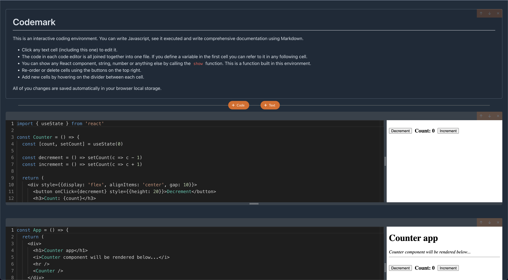

# Codemark

A web-based coding environment where you can write Javascript, see it executed and write comprehensive documentation using Markdown.

You can try it live at [codemark.netlify.app](https://codemark.netlify.app)



## Features

- [x] Add multiple code or text cells
- [x] Re-order and delete cells.
- [x] Write and preview Markdown with an easy to use editor
- [x] Write, execute and see the output of modern Javascript inside the browser
- [x] Import any npm package that works in the browser
- [x] Format code with Prettier
- [x] The code in each code editor is all joined together into one file. If you define a variable in the first cell you can refer to it in any following cell.
- [x] Resize cells vertically or horizontally
- [x] Built in `show` function for showing any javascript values and React components.
- [x] Autosaving in the browser local storage

## How the code execution works

The Javascript code is bundled with esbuild inside the browser thanks to WebAssembly, the imported packages are fetched from [unpkg.com](https://unpkg.com/) and cached inside IndexedDB for performance, the bundled code is executed safely in an isolated iframe element.

## Technologies used

- [React](https://reactjs.org/)
- [Redux](https://redux.js.org/)
- [Typescript](https://www.typescriptlang.org/)
- [Esbuild](https://esbuild.github.io/)
- [UNPKG](https://unpkg.com/)
- [Monaco editor](https://microsoft.github.io/monaco-editor/)
- [Prettier](https://prettier.io/)

## Local installation

1. **Clone the project**

```
 git clone https://github.com/marconunnari/codemark
 cd codemark
```

3. **Install and run the frontend (http://localhost:3000)**
```
yarn
yarn start
```
